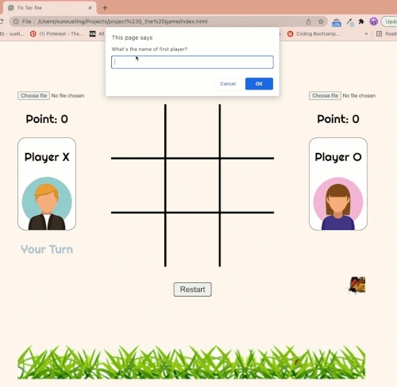

TIC TAC TOE - Week 3 version
=====================================

This is a simple tic-tac-toe web game, using<br/>
   1. **HTML**
   2. **CSS**
   3. **JAVASCRIPT (+ JQUERY)**
</br>

Try it and leave your comment! Ready to recieve any 
feedback!
</br>
Click [here](https://123mandy.github.io/Project_Tic-Tac-Toe/) to play!

***
## Brief


See this link as brief --- [Brief link](https://gist.github.com/wofockham/8e959d5cfe7d120f1157)

***
## Function

1. You can play with one of your friends
2. **Customize players'names**
3. **Customize your tokens**
4. Keep track of **multiple game rounds** with a win counter
5. Animation and audio added
6. Add logo to title bar

7. ## AI play mode to be coming soon!

***
## Screen Shot


***
## Bug and solution
* When the prompt poped up befor the css styling of the web page loads. In order to fix this bug, I use ```setTimeOut``` to make the pop-up window run after the page fully loads.

```javascript
const namePlayer = function () {
    let input1 = prompt("What's the name of first player?");
    let input2 = prompt("What's the name of second player?");
    if (input1 !== null && input1 !== "") {
        $('.player1name').text(input1);
    } else {
        $('.player1name').text("Player X")
    }
    if (input2 !== null && input2 !== "") {
        $('.player2name').text(input2);
    } else {
        $('.player2name').text("Player O")
    }
}
setTimeout(namePlayer, 200);
```
* When player X use the last play to win the game, sometimes may have bugs to show both winning condition and tie condition. In order to fix this bug, put the if statement of tie condition out of the for loop which checks the winning condition.

